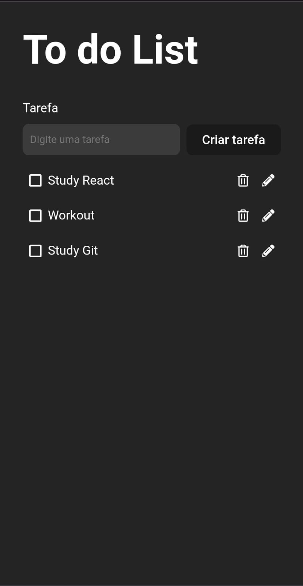

# To do List

This application was created to help users manage their daily activities. 

### Functionalities
User can: 
- Create 
- Check 
- Edit
- Remove
- List 

### Development process
Working on this project allowed me to:
- Manipulate arrays to list, save, edit and retrieve data using localStorage 
- Implement Hooks: 
  - useState, 
  - useEffect, 
  - useContext, 
  - useForm
- Create React components

## Skills
* TypeScript
* React

## Screenshot 

### Mobile

  

### Desktop

## Author
[Nayara Luiza Tavares Moraes](https://github.com/nalutm)
